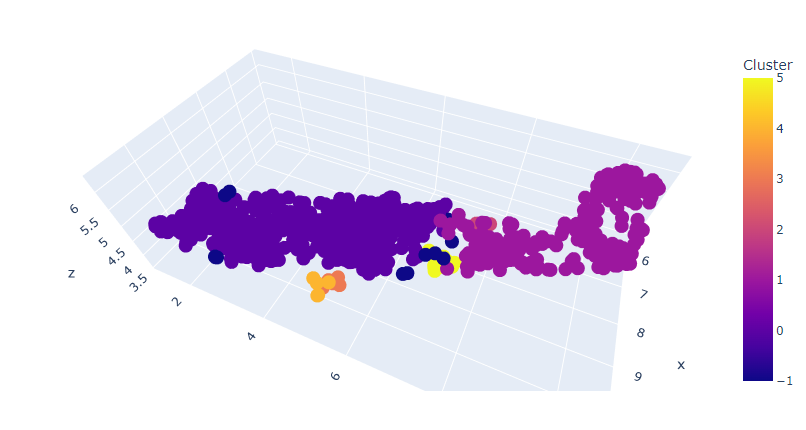

# Face Clusters

<a href="https://colab.research.google.com/drive/1BoVgfhUg43Mm6rYp9DrV2Al09uu0ksm1?usp=sharing"></a>

In this repository, I've experimented with face recognition by clustering image embeddings. The image embeddings are generated using [Retina-Face](https://github.com/serengil/retinaface) and reduced to a 2 or 3 dimensional representation using [UMAP](https://umap-learn.readthedocs.io/en/latest/) dimensionality reduction algorithm. Later the vectors are labelled into clusters using [DBSCAN](https://scikit-learn.org/stable/modules/generated/sklearn.cluster.DBSCAN.html) and [HDBSCAN](https://hdbscan.readthedocs.io/en/latest/) algorithms.




### Project structure

```
.
├── clean.py
├── embed.py
├── faces
│   ├── face1
│   └── face2
├── faces.py
├── flow.sh
├── imgs
│   ├── face1
│   └── face2
├── other-methods
│   ├── faces-mtcnn.py
│   ├── faces-nudenet.py
│   └── faces-retina.py
├── README.md
├── requirements.txt
└── viz.py
```

### Usage

- Clone the repo.
- Run `pip install -r requirements.txt`.
- Download the face dataset you like to use and set it according to the directory structure.
- Run the python files in this order (Or just run `flow.sh`):

```bash
python3 clean.py
python3 faces.py
python3 embed.py
```

## Conclusions

### Face Extraction

- MTCNN doesn't give much good results
- NudeNet is good but wastes compute on detecting other things
- retina-face is by far the best. Just uses a lot of resources. (Works good on Google Colab but, not recommended for local machine)

### Face recognition

- Facenet works just right
